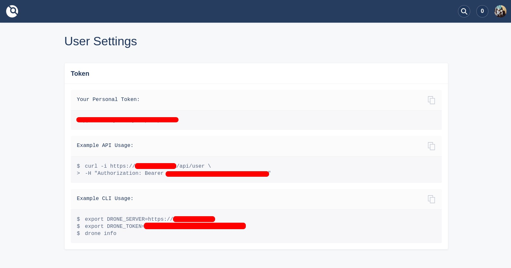

## Introduction

This tutorial will show you how to set up [Drone CI](https://drone.io/) for GitHub using Ansible. I've used Jenkins for a few years but now I'm looking for a better and simple CI/CD platform. I tried several tools like Github Actions, Bitbucket Pipelines, Travis CI but the suitable tool for me is Drone with those advantages:



* Lightweight
* Open source
* Configuration as Code
* Provide all plugins you need
* Seamlessly integrates with popular source code management systems
* Local execution



But when I first started I found that the Drone installation document is hard for me. So, I will share my steps here if it could help someone else like me :)


Although, GitHub is using for this article but you can use Drone with your favorite source code management system too.


## Prerequisites

You need to install Ansible by following [this installation guide](https://docs.ansible.com/ansible/latest/installation_guide/intro_installation.html) and has a basic understanding of Ansible.

**Prepare a GitHub OAuth application:**





## Ansible playbook

### Structure



* inventories
  * host.yml
* roles
  * drone
    * handlers
      * main.yml
    * tasks
      * cert.yml
      * main.yml
      * nginx.yml
      * provision.yml
      * start_drone.yml
    * templates
      * nginx.j2
      * agent.env.j2
      * server.env.j2
* drone.yml



### Source code

[https://github.com/cozi-dev/drone-ansible](https://github.com/cozi-dev/drone-ansible)

Clone it to your machine and update those file's variables with your own configurations:

#### inventories/host.yml

* **{{ YOUR_SERVER_IP_ADDRESS }}**: Server IP address

#### drone.yml

* **{{ YOUR_DOMAIN }}**: Drone domain address.
* **{{ YOUR_EMAIL }}**: Let's Encrypt registration email address.
* **{{ YOUR_DRONE_RPC_SECRET }}**: Authenticate the RPC connection to the Drone server.
* **{{ YOUR_DRONE_ADMIN_USER }}**: Drone admin user.
* **{{ YOUR_DRONE_GITHUB_CLIENT_ID }}**: GitHub client id.
* **{{ YOUR_DRONE_GITHUB_CLIENT_SECRET }}**: GitHub client secret.

### Run playbook to install Drone


ansible-playbook drone.yml -i ./inventories/host.yaml


After this step, you can go to your domain address to access Drone dashboard:



## Tips

You can config Drone CLI to manage secret variables by following this [link](https://docs.drone.io/cli/configure/).

Grab your API Token from **User settings**:

**For example:**

Add secret deploy ssh key by following command:


drone orgsecret add [[[cozi-dev]]] [[[deploy_ssh_private_key]]] [[[@/home/cozi/.ssh/id_rsa]]]


1. GitHub username or organization name.
2. Secret variable name.
3. Secret variable value.

For more details, please check [this documentation](https://docs.drone.io/secret/organization/).

## Conclusion

Drone is a great CI/CD platform that I enjoy using it so much. The configuration is on the code, so I don't need to manage it elsewhere. Build status can be monitored with a simple Slack plugin.

## References

1. https://docs.drone.io/server/provider/github/
2. https://docs.ansible.com/ansible/latest/user_guide/playbooks_intro.html
